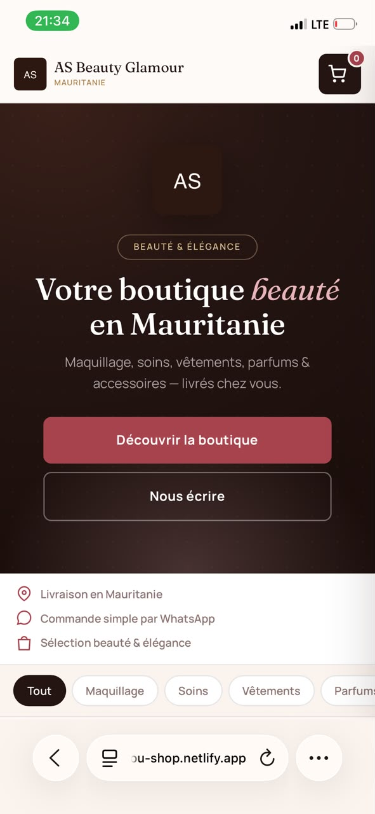
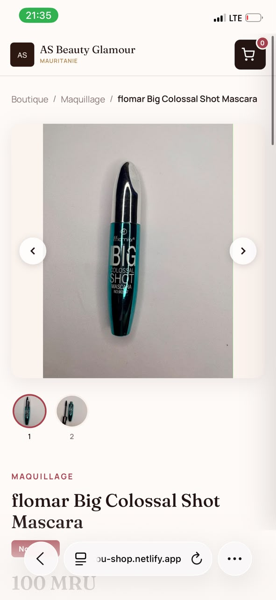
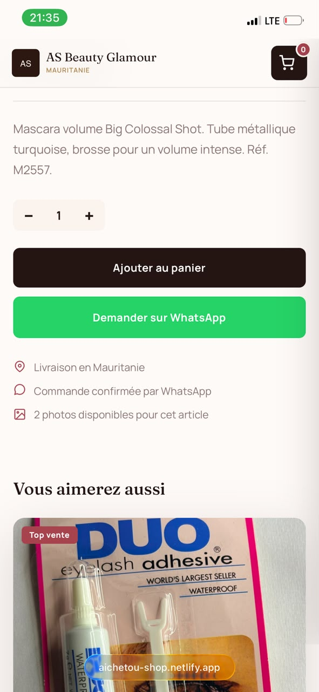

# AS Beauty Glamour

Boutique e-commerce de beauté pour la **Mauritanie** — commandes via WhatsApp, admin en temps réel (Firebase + Cloudinary).

**Démo live :** [dainty-douhua-75189e.netlify.app](https://dainty-douhua-75189e.netlify.app/shop.html)  
**Admin :** `/admin` (compte gérante)

---

## Aperçu

SPA (Single Page Application) en HTML/CSS/JS vanilla, déployée sur Netlify.

| Côté client | Côté admin |
|-------------|------------|
| Catalogue par catégorie + recherche | CRUD produits (multi-photos, stock) |
| Fiche produit (galerie, quantité) | Gestion des commandes + statuts |
| Panier + commande WhatsApp préremplie | Dashboard (produits, commandes, CA) |
| Validation téléphone mauritanien (2/3/4) | Export CSV des commandes |
| Responsive mobile / desktop | Notifications navigateur nouvelles commandes |

---

## Stack technique

- **Frontend :** HTML5, CSS3 (custom properties, responsive), JavaScript ES modules
- **Backend / data :** Firebase Authentication + Cloud Firestore (temps réel)
- **Images :** Cloudinary (upload unsigned, plan gratuit)
- **Commandes :** WhatsApp Business link (`wa.me`) + enregistrement Firestore
- **Hébergement :** Netlify (`netlify.toml` inclus)
- **Pas de framework** — un seul fichier principal (`shop.html`) pour simplicité et performance

---

## Structure du projet

```
AS Beauty Glamour/
├── index.html          # Redirection → shop.html
├── shop.html           # Boutique + admin (app complète)
├── admin.html          # Entrée admin (iframe → shop.html#admin)
├── assets/
│   └── logo.svg
├── netlify.toml        # Config déploiement + redirect /admin
└── README.md
```

---

## Fonctionnalités clés (portfolio)

1. **E-commerce léger adapté au contexte local**  
   Pas de paiement en ligne obligatoire : flux WhatsApp + admin, adapté à la Mauritanie.

2. **Gestion stock**  
   Rupture de stock, limite de quantité panier, badge « Rupture ».

3. **Multi-images produit**  
   Jusqu'à 6 photos par article, légendes, lightbox plein écran, `object-fit: contain`.

4. **Admin mobile-friendly**  
   Navigation sticky, formulaires tactiles, export CSV.

5. **Temps réel**  
   `onSnapshot` Firestore pour produits et commandes.

---

## Mise en route (développement)

1. Cloner le repo
2. Créer un projet [Firebase](https://console.firebase.google.com)
   - Auth : Email/Password
   - Firestore
3. Remplacer `firebaseConfig` et `ADMIN_EMAIL` / `WA` dans `shop.html`
4. Appliquer les règles Firestore (voir ci-dessous)
5. Configurer Cloudinary (cloud name + preset unsigned)
6. Ouvrir `shop.html` en local ou déployer sur Netlify

### Règles Firestore (exemple)

```js
rules_version = '2';
service cloud.firestore {
  match /databases/{database}/documents {
    function isAdmin() {
      return request.auth != null
        && request.auth.token.email == "VOTRE_EMAIL_ADMIN";
    }
    match /products/{id} {
      allow read: if true;
      allow create, update, delete: if isAdmin();
    }
    match /orders/{id} {
      allow create: if true;
      allow read, update, delete: if isAdmin();
    }
  }
}
```

> Les clés Firebase client sont publiques par design ; la sécurité repose sur les **règles** et le compte admin.

---

## Déploiement Netlify

1. Connecter le repo GitHub à Netlify
2. Publish directory : racine du dossier
3. Le fichier `netlify.toml` gère déjà le chemin `/admin`

---

## Points forts pour le portfolio

- **Problème résolu :** vendre en Mauritanie sans checkout bancaire complexe
- **Choix techniques :** vanilla JS + Firebase (coût quasi nul, temps réel)
- **UX locale :** numéros 2/3/4, livraison Mauritanie, WhatsApp
- **Admin utilisable sur téléphone** (cible : gérante de boutique)


---
## Captures d'écran

### Boutique
    

### Fiche produit
       

### Panier & commande


### Espace admin


---
## Auteur

Zahra Boubacar
Data Analyst · Business Intelligence · Data Science
Master Data Science & Software Development — ESEN (Tunisie)

GitHub : ZahraBoubacar
LinkedIn : zahra-boubacar
Email : zahraboubacar9@gmail.com


---

## Licence

Usage privé / client. Adapter librement pour d'autres boutiques (crédits appréciés).
