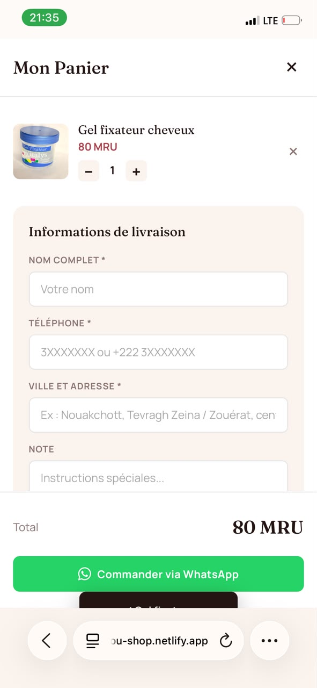

# AS Beauty Glamour

Boutique e-commerce de beauté pour la **Mauritanie** — commandes via WhatsApp, admin en temps réel (Firebase + Cloudinary).

**Démo live :** [dainty-douhua-75189e.netlify.app](https://dainty-douhua-75189e.netlify.app/shop.html)  
**Admin :** `/admin` (compte gérante)

---

## Aperçu

SPA (Single Page Application) en HTML/CSS/JS vanilla, déployée sur Netlify.

| Côté client | Côté admin |
|-------------|------------|
| Catalogue par catégorie + recherche | CRUD produits (multi-photos, stock) |
| Fiche produit (galerie, quantité) | Gestion des commandes + statuts |
| Panier + commande WhatsApp préremplie | Dashboard (produits, commandes, CA) |
| Validation téléphone mauritanien (2/3/4) | Export CSV des commandes |
| Responsive mobile / desktop | Notifications navigateur nouvelles commandes |

---

## Captures d'écran

## Captures d'écran

### Boutique

### Fiche produit

### Panier & commande

### Espace admin

---

## Stack technique

- **Frontend :** HTML5, CSS3, JavaScript ES modules
- **Backend / data :** Firebase Authentication + Cloud Firestore (temps réel)
- **Images :** Cloudinary (upload unsigned)
- **Commandes :** WhatsApp Business (`wa.me`) + enregistrement Firestore
- **Hébergement :** Netlify
- **Pas de framework** — un seul fichier principal (`shop.html`)

---

## Structure du projet

as-beauty-glamour/
├── index.html
├── shop.html
├── admin.html
├── assets/
├── netlify.toml
└── README.md

---

## Fonctionnalités clés

1. **E-commerce adapté au contexte local** — flux WhatsApp + admin, sans paiement en ligne obligatoire  
2. **Gestion stock** — rupture, limite panier, badge « Rupture »  
3. **Multi-images produit** — jusqu’à 6 photos, lightbox, `object-fit: contain`  
4. **Admin mobile-friendly** — navigation sticky, export CSV  
5. **Temps réel** — `onSnapshot` Firestore pour produits et commandes  

---

## Points forts pour le portfolio

- Problème résolu : vendre en Mauritanie sans checkout bancaire complexe  
- Choix techniques : vanilla JS + Firebase (coût quasi nul, temps réel)  
- UX locale : numéros 2/3/4, livraison Mauritanie, WhatsApp  
- Admin utilisable sur téléphone  

---

## Auteure

**Zahra Boubacar**  
Data Analyst · Business Intelligence · Data Science  
Master Data Science & Software Development — ESEN (Tunisie)

- GitHub : [ZahraBoubacar](https://github.com/ZahraBoubacar)  
- LinkedIn : [zahra-boubacar](https://linkedin.com/in/zahra-boubacar-490927312)  
- Email : zahraboubacar9@gmail.com  

---

## Licence

Usage privé / client. Adapter librement pour d’autres boutiques (crédits appréciés).
